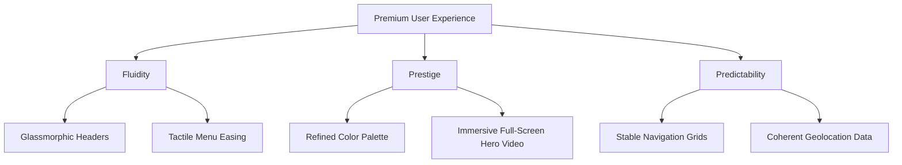

# Accenture Song CXO Review: Delivering a Premium Experience

**To:** The Inflexions Leadership Team  
**From:** Chief Experience Officer, Accenture Song  
**Subject:** Brand Experience, UI, and Interaction Audit  

At Accenture Song, we believe that world-class digital experiences are built at the intersection of brand purpose, emotional resonance, and absolute interaction fluidness. A premium experience is not just about what a site does; it is about how it **feels** to the user. It must feel prestigious, intuitive, and alive. 

Having reviewed the Inflexions site layout, typography, navigation, and interactions, here is my no-holds-barred UX/UI audit, detailing our major friction points and a proposed strategy to elevate the platform to a premium, enterprise-grade standard.

---

## 1. Executive Summary & Brand Perception

Currently, the Inflexions website presents a solid foundation of information but suffers from **visual monotony** and **unexpected interaction friction**. The visual language reads like a standard mid-tier IT service firm rather than a cutting-edge enterprise integration partner leading the AI era. 

To deliver a premium experience that commands authority, we must shift from a template-driven layout to a **high-prestige digital story**.

---

## 2. Top Five Experience & UI Flaws

### 1. The Jarring "SwapGrid" Interaction (CRITICAL UX FAILURE)
* **Location**: [src/app/components/SwapGrid.tsx](file:///c:/Users/ekowt/Projects/inflexionsweb/src/app/components/SwapGrid.tsx)
* **The Flaw**: When a user hovers over one of the four capability blocks (e.g., *Cloud Services*) for 1000ms, the cards physically swap positions in the grid layout, shifting the hovered card to the top slot.
* **Why it fails**: This violates the fundamental UX law of **user control and predictability**. If a user hovers over a block intending to read or click it, the content suddenly moves away from under their cursor. This layout shifting is disorienting, creates high cognitive load, and frequently causes users to click the wrong link.
* **Remediation**: Remove the layout-shifting position swap. Replace it with a stable, elegant grid where hovering a card expands its details, triggers a glowing gradient border, or cross-fades related background images in a fixed preview section.

### 2. Branding Blackout on Mobile (HIGH SEVERITY)
* **Location**: [src/app/components/Header.tsx](file:///c:/Users/ekowt/Projects/inflexionsweb/src/app/components/Header.tsx)
* **The Flaw**: The Inflexions logo is hidden completely on mobile viewports (`hidden lg:block`). The mobile header shows only a hamburger menu icon on the left and a "Contact us" button on the right. The brand identity is completely invisible at the top on mobile.
* **Why it fails**: A premium brand should never hide its identity on the device where 60%+ of users will experience it. Additionally, the desktop logo is absolute-positioned using a fragile layout calculation: `style={{ left: "calc((100vw - 80rem) / 4 + 1rem)" }}`. This layout model breaks cleanly on ultra-wide screens or when windows are resized.
* **Remediation**: Restructure the header to place the logo inside a standard, responsive flex container, displaying a compact brand mark on mobile viewports and a full wordmark on desktop viewports.

### 3. Trust-Eroding Geographical Mismatch (MEDIUM SEVERITY)
* **Location**: [src/app/about/page.tsx](file:///c:/Users/ekowt/Projects/inflexionsweb/src/app/about/page.tsx#L344-L362)
* **The Flaw**: The Google Map iframe title is `"Location map of Tsui Bleoo Rd, Accra"` (located in Teshie), but the address card overlay positioned directly on top lists the headquarters address as `"#2 Dei Close, East Legon, Accra"`.
* **Why it fails**: These two locations are in entirely different parts of Accra. Inconsistencies in basic contact information instantly raise red flags for enterprise clients looking for local partners.
* **Remediation**: Update the Google Map iframe source coordinates to point precisely to East Legon, matching the corporate address card.

### 4. Color Monotony & Lack of Visual Depth
* **Location**: [src/app/globals.css](file:///c:/Users/ekowt/Projects/inflexionsweb/src/app/globals.css) and Global Styles
* **The Flaw**: The palette relies heavily on flat, generic primary red (`#BD2E25`) and standard navy blue (`#1B3764` / `#265982`) on stark white backdrops.
* **Why it fails**: These flat, highly saturated corporate primaries look dated and generic. They lack the depth and sophistication expected of a premium, modern technology brand.
* **Remediation**: Transition to a "Tech Prestige" color palette: deep slate space navy (`#0B132B`), crimson ruby (`#E53E3E`), and warm ivory surfaces, accented by glassmorphic overlays, dark-mode elements, and subtle radial gradients that add visual depth.

### 5. Static, Instant Transitions (Friction over Fluidity)
* **Location**: Site-wide Dropdowns and Menus
* **The Flaw**: Dropdowns, mobile menu drawers, and Accordions snap open instantly or with minimal, linear animations. 
* **Why it fails**: Premium interfaces feel alive. Snapping elements make the web application feel static, mechanical, and cheap.
* **Remediation**: Implement spring-physics-like easing (`cubic-bezier(0.16, 1, 0.3, 1)`) for all dropdowns, slide-outs, and mobile menus to create a tactile, luxurious feel.

---

## 3. The Song Experience Strategy

To transform the Inflexions experience, we propose a three-part transformation focused on **Fluidity**, **Prestige**, and **Predictability**:

### Proposed Experience Enhancements

| Area | Current State | Song Proposed Premium Standard |
| :--- | :--- | :--- |
| **Header** | Solid white, absolute positioned, logo hidden on mobile. | Transparent glassmorphic header with frosted-glass backing on scroll; unified flex positioning with mobile logo badge. |
| **Hero Banner** | Fixed-height static image, basic slide-up text. | Immersive `h-[85vh]` hero with ambient, muted dark background loop (IT networking theme) and clean typography. |
| **Core Grids** | Jarring `SwapGrid` swapping cards on hover. | **Stable Feature Showcase Grid**: Cards stay static but light up with gradient border glows; clicking opens smooth overlay transitions. |
| **Micro-interactions**| Instant snapping dropdowns. | Smooth bezier slide-and-fade dropdown menus (`duration-300 ease-[cubic-bezier(0.16,1,0.3,1)]`). |
| **Branding & Content** | Contradictory addresses, generic shapes. | Aligned maps, custom-styled SVG icons, and a cohesive font scaling system. |

---

## 4. Next Steps & Recommendations

To deliver on this CX vision, we should implement these design corrections in a coordinated phase:
1. **Fix the header structure and mobile logo visibility.**
2. **Replace the `SwapGrid` with a stable, premium interactive grid component.**
3. **Correct the Map location on the About page.**
4. **Introduce frosted-glass styling and smooth cubic-bezier transitions for menus.**

Let me know if you would like me to draft the implementation plan to rewrite these components to meet this premium, high-fidelity experience standard!
